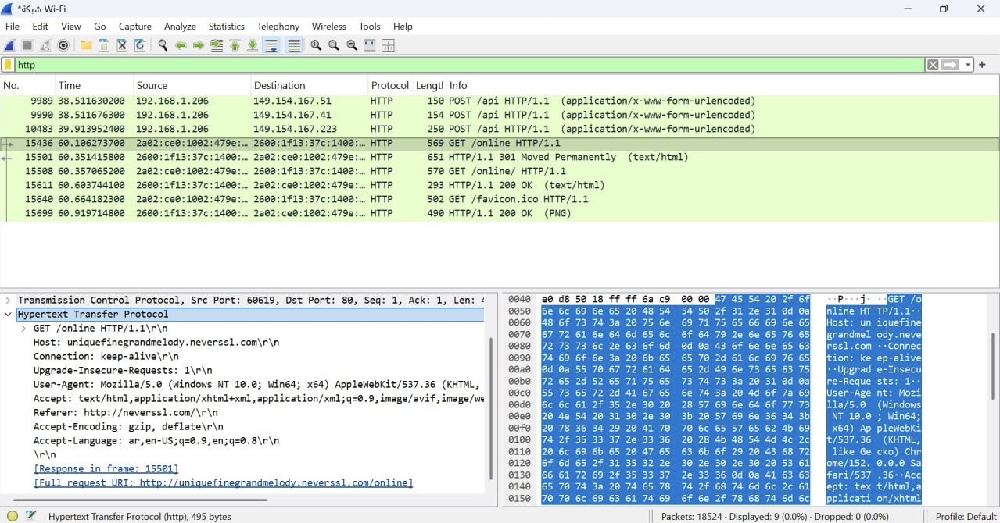
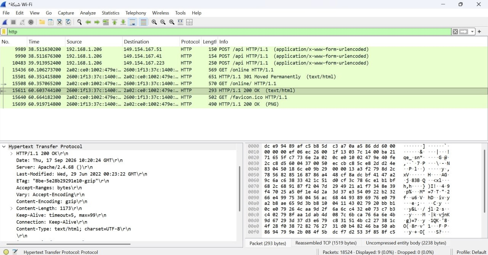
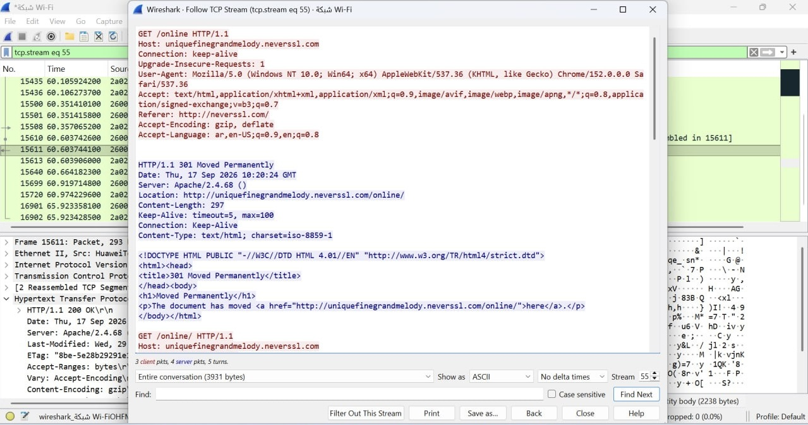
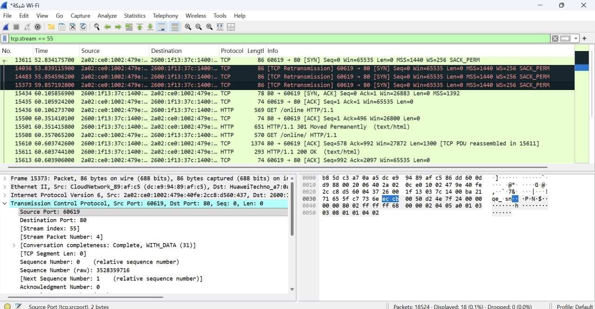
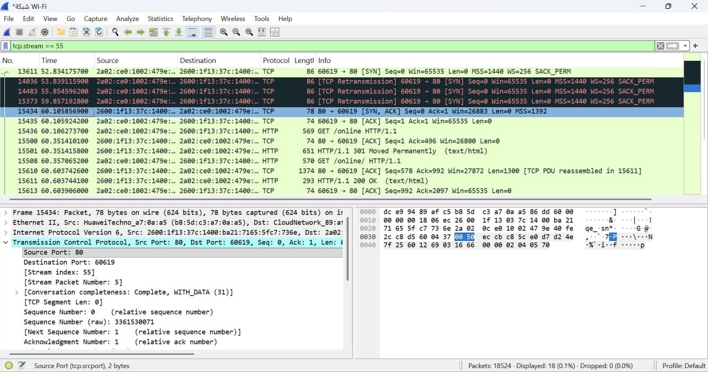
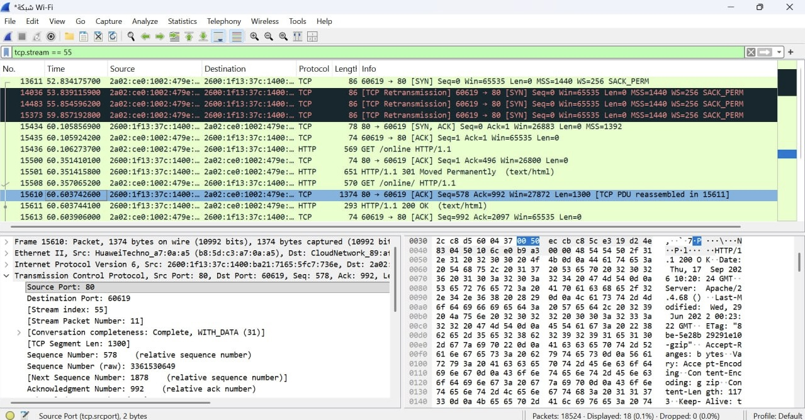
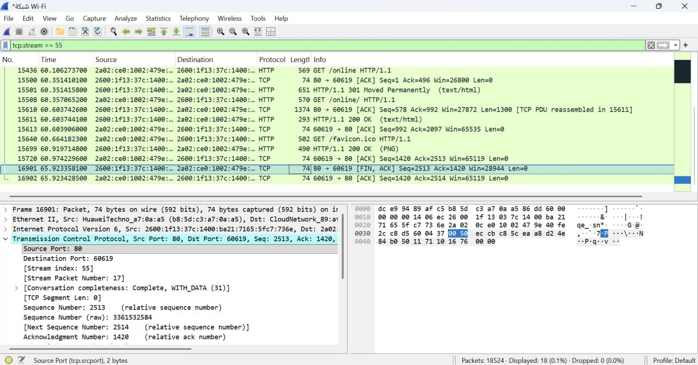
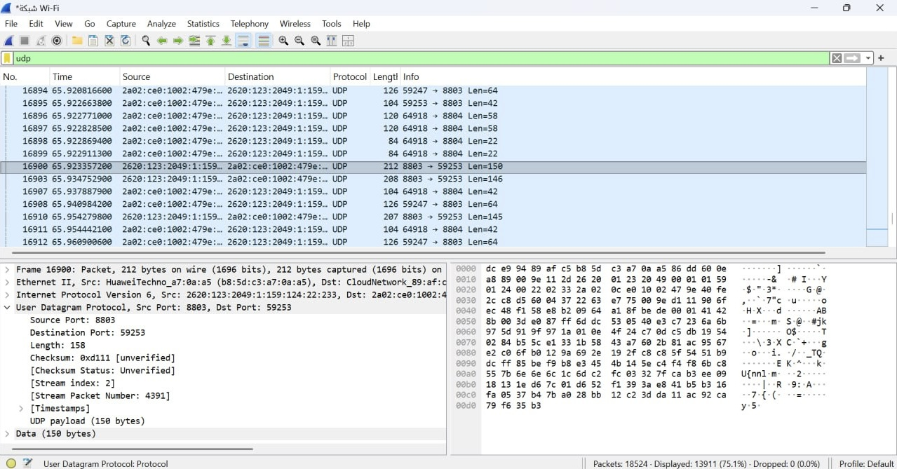

# CS471 – Web Technologies
## Lab 1: The Internet Protocols
### Wireshark – HTTP, TCP/IP and UDP Analysis

---

## Part 1: Capturing HTTP Traffic

### HTTP Request
The HTTP GET request was captured using Wireshark.

### HTTP Response
The server returned an HTTP 200 OK response.

---

## Part 2: Analyzing TCP/IP Traffic

### Follow TCP Stream
The TCP stream shows the communication between the client and the server.

### TCP Three-Way Handshake
The connection was established using SYN, SYN-ACK, and ACK.

### Sequence and Acknowledgment Numbers
The SYN-ACK packet shows relative Sequence Number = 0 and Acknowledgment Number = 1.

### TCP Data Transfer
The captured TCP segment contains 1300 bytes of data.

### TCP Termination
FIN-ACK and ACK packets were observed during connection termination.

---

## Part 3: Capturing and Analyzing UDP Traffic

The selected UDP packet contains the following information:

| Field | Value |
|---|---|
| Source Port | 8803 |
| Destination Port | 59253 |
| UDP Length | 158 bytes |
| UDP Payload | 150 bytes |

---

## Part 4: Comparing TCP and UDP

### Table 1: TCP or UDP? Provide Reasons

| Feature | TCP or UDP | Reasons |
|---|---|---|
| Reliability and Connection Establishment | TCP | TCP establishes a connection using a three-way handshake and provides reliable delivery through acknowledgments and retransmissions. |
| Data Integrity and Ordering | TCP | TCP uses checksums to detect errors and sequence numbers to deliver data in the correct order. |

### Table 2: Use Cases and Performance

| | TCP | UDP |
|---|---|---|
| Use Cases | Web browsing, email, and file transfer. | Online gaming, VoIP, and live streaming. |
| Performance | More overhead due to connection setup, acknowledgments, and retransmissions. | Lower overhead and no connection setup, making it suitable for real-time applications. |
